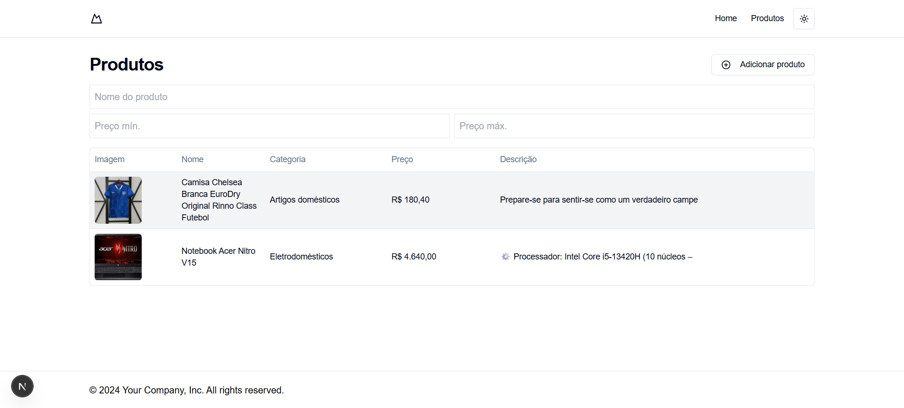

# teste-frontend-thera


| Products|
|-------|
||


## Prisma studio 

`npx prisma studio`


## ✔️ Técnicas e tecnologias utilizadas

Lista das bibliotecas utilizadas no desenvolvimento:

- `@hookform/error-message`
- `@hookform/resolvers`
- `@prisma/client`
- `@radix-ui/react-dialog`
- `@radix-ui/react-dropdown-menu`
- `@radix-ui/react-label`
- `@radix-ui/react-navigation-menu`
- `@radix-ui/react-popover`
- `@radix-ui/react-progress`
- `@radix-ui/react-select`
- `@radix-ui/react-slot`
- `@radix-ui/react-toast`
- `axios`
- `class-variance-authority`
- `clsx`
- `date-fns`
- `lucide-react`
- `next`
- `next-auth`
- `next-themes`
- `react`
- `react-day-picker`
- `react-dom`
- `react-hook-form`
- `recharts`
- `sonner`
- `tailwind-merge`
- `tailwindcss-animate`
- `zod`


## 🛠️ Abrir e rodar o projeto

### Necessário criar .env

```bash

DATABASE_URL="file:./dev.db"
```

 Dentro da pasta do projeto execute `npm i` ou `yarn` para instalar as dependências depois renomeie `env-exemple` para `.env` que está na raiz do projeto , no terminal e na raiz do projeto execute `npm run dev:server` ou `yarn dev:server`.